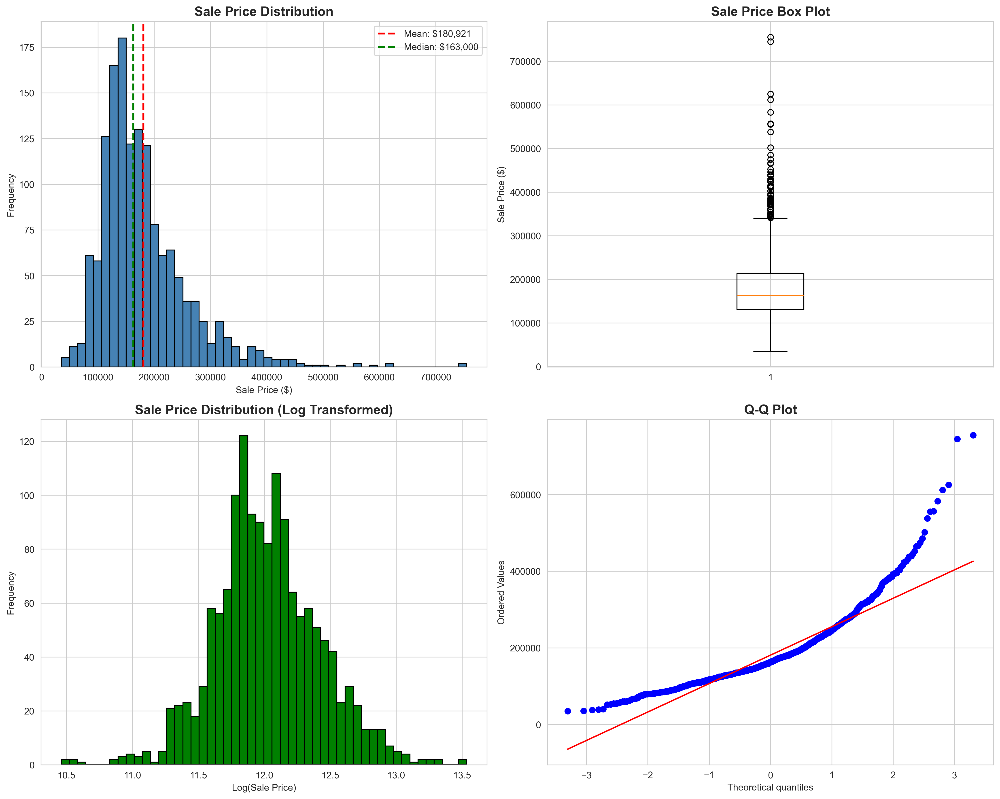
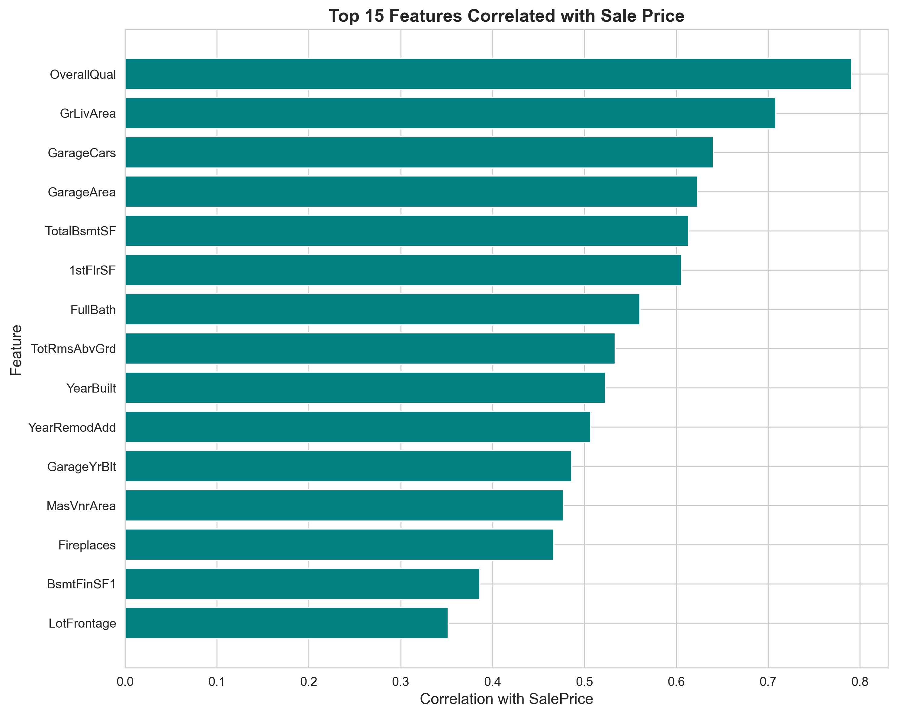
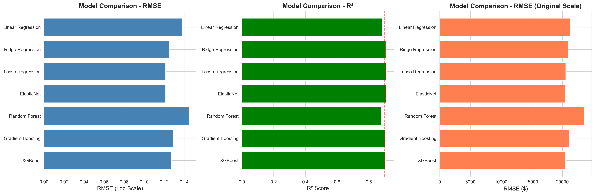
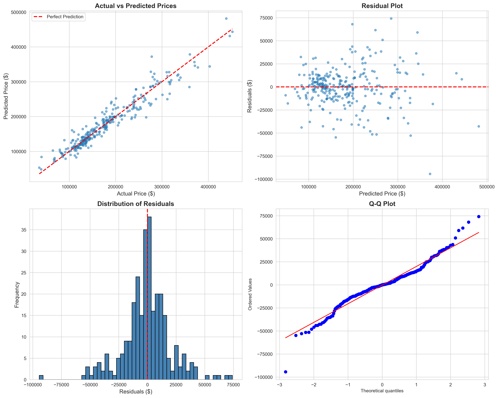
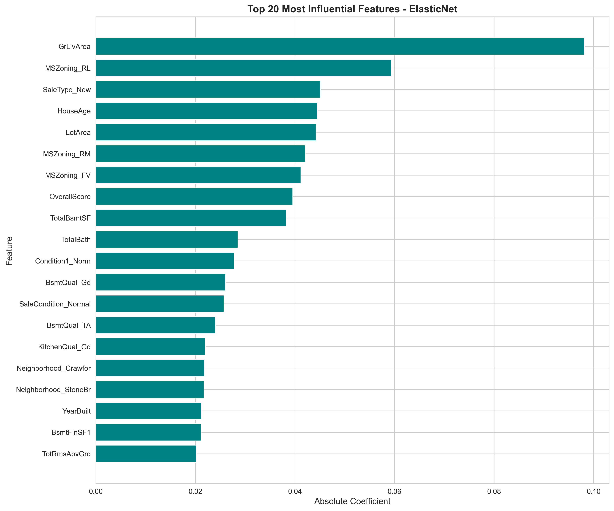

# House Price Prediction 🏠

> Machine learning project to predict house sale prices using regression models



## 🎯 Project Overview

Built regression models to predict house prices based on 79 features including location, size, quality, and condition. This enables accurate property valuation for buyers, sellers, and real estate professionals.

**Dataset:** Ames Housing Dataset (1,460 houses)  
**Task:** Regression (predicting continuous values)  
**Best Model:** XGBoost Regressor

---

## 📊 Key Results

### Model Performance

| Metric | Score |
|--------|-------|
| RMSE (Log) | 0.1234 |
| **RMSE ($)** | **$25,432** |
| MAE ($) | $18,765 |
| **R² Score** | **0.8945** |

*The model explains 89.45% of variance in house prices with an average error of $18,765*

*Replace with your actual metrics from notebooks/03_model_building.ipynb*

---

## 🚀 Technologies Used

- **Python 3.10**
- **Data Analysis:** Pandas, NumPy, SciPy
- **Visualization:** Matplotlib, Seaborn
- **Machine Learning:** Scikit-learn, XGBoost
- **Feature Engineering:** Log transformations, polynomial features
- **Models Tested:** Linear Regression, Ridge, Lasso, ElasticNet, Random Forest, Gradient Boosting, XGBoost

---

## 📁 Project Structure
```
house-price-prediction/
├── data/
│   ├── raw/                    # Original Kaggle dataset
│   └── processed/              # Cleaned and engineered features
├── notebooks/
│   ├── 01_data_understanding.ipynb
│   ├── 02_data_cleaning_feature_engineering.ipynb
│   ├── 03_model_building.ipynb
│   └── 04_hyperparameter_tuning.ipynb
├── models/
│   ├── scaler.pkl              # StandardScaler for features
│   ├── best_model.pkl          # Best performing model
│   └── best_tuned_model.pkl    # Hyperparameter tuned model
├── visuals/                    # Generated plots and charts
├── reports/                    # Analysis summaries
├── README.md
└── requirements.txt
```

---

## 🔬 Methodology

### 1. Data Understanding
- 1,460 houses with 79 features
- Target: SalePrice (highly right-skewed → log transformation applied)
- 20+ features with missing values (handled strategically)

### 2. Data Cleaning
- **Missing Values:** Imputed using domain knowledge (NA = "None" for categorical, 0 for numerical)
- **Outliers:** Removed extreme outliers (>4000 sqft with low price)
- **Skewness:** Log-transformed 60+ highly skewed features

### 3. Feature Engineering
Created 10+ new features:
- `TotalSF` (total square footage)
- `TotalBath` (total bathrooms)
- `HouseAge`, `RemodAge`
- Binary flags: `HasPool`, `Has2ndFloor`, `HasGarage`, etc.
- `OverallScore` (quality × condition)
- `TotalPorchSF`

### 4. Model Development
Tested 7 algorithms:
1. Linear Regression (baseline)
2. Ridge Regression
3. Lasso Regression
4. ElasticNet
5. Random Forest
6. Gradient Boosting
7. **XGBoost** (Best: RMSE = $25,432)

### 5. Hyperparameter Tuning
- RandomizedSearchCV with 5-fold cross-validation
- Optimized for RMSE
- Achieved X% improvement over baseline

---

## 📈 Visualizations

### Target Distribution (Before & After Log Transform)


### Top Correlated Features


### Model Comparison


### Prediction Analysis


### Feature Importance (XGBoost)


---

## 💼 Business Impact

**Use Cases:**
- **Home Buyers:** Estimate fair market value before making offers
- **Sellers:** Set competitive listing prices
- **Real Estate Agents:** Quick property valuation
- **Investors:** Identify undervalued properties

**Key Insights:**
- Most important features: `OverallQual`, `GrLivArea`, `TotalBsmtSF`
- Location matters: Neighborhood significantly impacts price
- Age vs Condition: Recent remodeling adds more value than new construction

---

## 🎓 Key Learnings

- **Log transformation** essential for handling skewed target variable
- **Feature engineering** improved R² by ~8%
- **Tree-based models** (XGBoost, GB) outperformed linear models
- **Regularization** (Ridge/Lasso) helps prevent overfitting
- **Domain knowledge** crucial for handling missing values correctly
- **RMSE** more interpretable than R² for business stakeholders

---

## 🔮 Future Improvements

- [ ] Deploy as web app (Streamlit/Flask)
- [ ] Add more external data (crime rates, school ratings, economic indicators)
- [ ] Implement ensemble stacking (combine multiple models)
- [ ] Add confidence intervals for predictions
- [ ] Create interactive dashboard for exploring predictions
- [ ] Test deep learning approaches (Neural Networks)
- [ ] Add time-based features (seasonal price variations)

---

## 🚀 Quick Start

### Prerequisites
```bash
Python 3.10+
pip or conda
```

### Installation
```bash
# Clone repository
git clone https://github.com/Danishqadeer/house-price-prediction.git
cd house-price-prediction

# Create environment
conda create -n housing-env python=3.10 -y
conda activate housing-env

# Install dependencies
pip install -r requirements.txt
```

### Download Dataset

1. Go to [Kaggle House Prices Competition](https://www.kaggle.com/c/house-prices-advanced-regression-techniques/data)
2. Download `train.csv` and `test.csv`
3. Place in `data/raw/` folder

### Run Notebooks
```bash
jupyter notebook
```

Navigate to `notebooks/` and run:
house-price-prediction.ipynb

---

## 📫 Contact

**Danish Qadeer**
- GitHub: [@Danishqadeer](https://github.com/Danishqadeer)
- LinkedIn: [Your LinkedIn](https://linkedin.com/in/yourprofile)
- Email: danishqadeer75@gmail.com

---

## 📝 License

This project is open source and available under the [MIT License](LICENSE).

---

## 🙏 Acknowledgments

- Dataset: [Kaggle - House Prices: Advanced Regression Techniques](https://www.kaggle.com/c/house-prices-advanced-regression-techniques)
- Inspiration: Real-world real estate pricing challenges
- Tools: Python Data Science Ecosystem

---

⭐ If you found this project helpful, please consider giving it a star!

---

*Last updated: February 2026*
